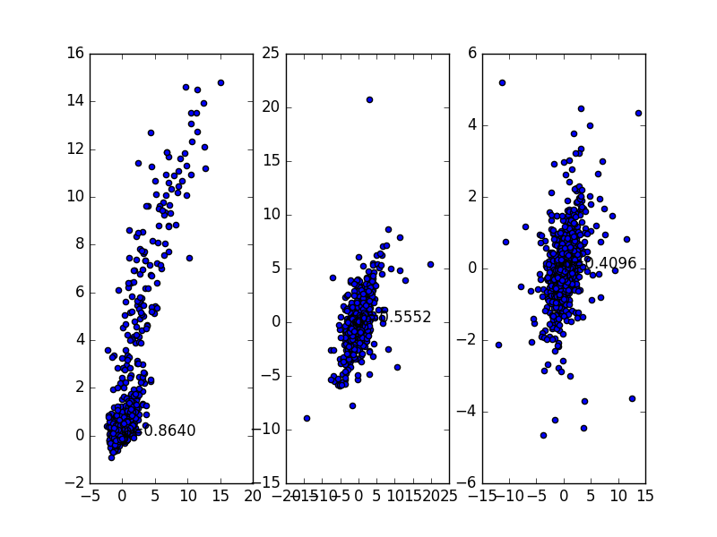
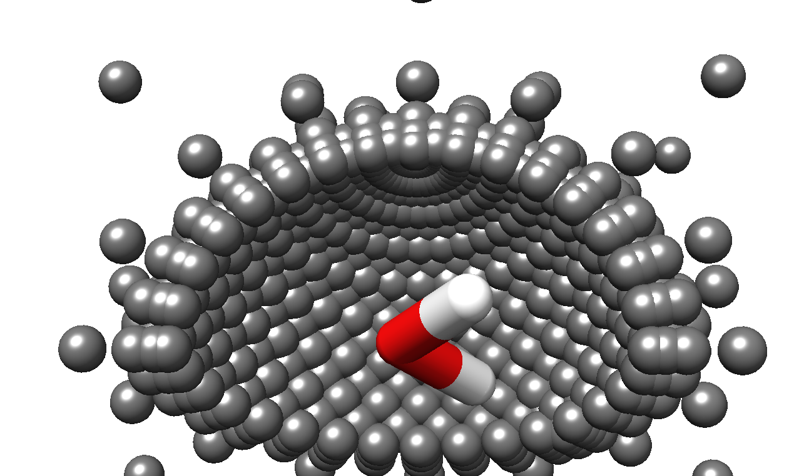
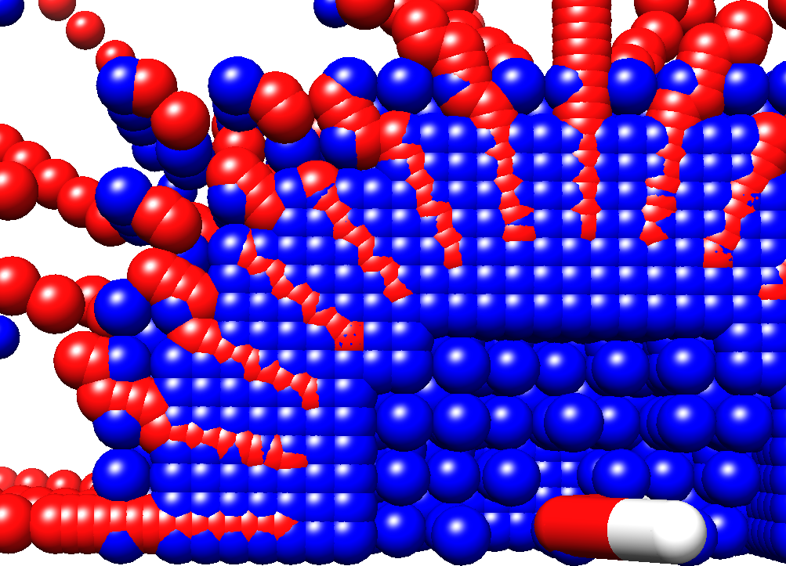

# Testing tree-based Adaptive Mesh
## 1. 前言
使用 adaptive mesh 的初衷是替代现有的经验性打格点的方法, 自动根据已有格点, 针对性地增加特定区域地网格密度(Adaptive mesh refinement, AMR). 这面临着2个问题:
  1. 如何组织格点使网格具有 adaptive refinement 的特性.
  2. 如何使网格收敛, 或者说, 如果判断哪些地方需要加密, 哪些不用.      

下面我将介绍在这两个问题上探索的进展, 以及遇到的问题.

## 2. 网格结构
### 2.1 网格类型
常用的Adaptive mesh有一下3种:
  1. distortion mesh    
    

  2. tree-based mesh    
    

  3. block structured mesh     
    
### 2.2 原有的网格结构
花兰博士使用的应该属于第1种, distortion mesh, 在近程格点很密, 远程更稀疏. 而在哪里加密, 主要靠经验. 黄荷博士使用的网格和花兰博士的类似.    
下图是2000个随机的 water dimer 构象(测试集), QM 能量随质心距离 r 变化的散点图. 横坐标是r, 纵坐标是QM算出的能量E.

可以看出能量与r有很大的相关性, 在近距离(2 - 3.5 A), 能量随r变化很大, 所以原有网格 r 在[2 - 3.5]的步长为 0.1 A.

下图是黄荷博士约40万格点中平移空间2702个格点的分布:   

   

以分子力学(MM)计算所有格点能量, 以2000个随机构象作为测试集进行插值, 结果如下:    

从左到右依次为Enegy, Force, Torque, 横坐标是基于MM计算值, 纵坐标为插值结果.
可以看到线性非常好(能量的相关系数达到0.9994).

**故在测试 tree-based mesh 的时候, 以黄荷博士的网格作为参照.**

### 2.3 基于树结构的网格
一对水的构象空间是平移空间和旋转空间的乘积, 实现用树结构表示构象空间, 需要实现树结构表示平移空间和旋转空间. 在这里, 我基于四元数对旋转空间进行剖分. 平移空间尝试了基于直角坐标系(x,y,z) 和球坐标系(r, phi, theta)的八叉树剖分.
#### 2.3.1 旋转空间基于四元素剖分
这个我很难讲清楚, 基本原理是四元素表示的旋转空间与四维空间中的半球等价, 四维球'面'可以映射到8个正方体中, 半球映射到4个正方体中, 每个正方体再基于八叉树剖分. 具体可以看参考文献 [*Quaternions in molecular modeling*](http://www.sciencedirect.com/science/article/pii/S1093326306000829).
#### 2.3.2 平移空间基于球坐标系剖分
球坐标系中, r取值[0,+无穷), phi是与xy平面的夹角,取值范围 [-pi/2, pi/2], theta是与x轴的夹角, 取值[-pi,pi).       

以中心水分子的质心为原点, H-O-H夹角平分线为x轴, H-O-H平面法线为z轴, z叉乘x为y轴, 建立坐标系.      

由于水基于xy, xz 平面对称, 只需算1/4球就可以通过镜面操作得到其他构像, 当距离>12 A, 相互作用可以忽略不计. 则 r, phi, theta的取值范围是 r[2, 12], phi[0, pi/2], theta[0, pi].    

下图是1574个平移空间格点的分布:

Adaptive mesh refinement 拿到的最好的结果如下图, 约17万构象:

从左到右依次为Enegy, Force, Torque, 横坐标是基于MM计算值, 纵坐标为插值结果.

#### 2.3.3 平移空间基于直角坐标系剖分
以x[-12, 12], y[-12, 12], z[-12, 12]为初始空间, 考虑对称性, 仅计算y>=0和z>=0的2个象限.
下图是19516个平移空间格点的分布:   

Adaptive mesh refinement 拿到的最好的结果如下图, 约60万构象:

从左到右依次为Enegy, Force, Torque, 横坐标是基于MM计算值, 纵坐标为插值结果.

## 3. 收敛策略及结果  
关于如何收敛, 是与网格结构相适应. 大体的收敛策略是: 先让旋转空间收敛然后让平移空间收敛. 以格点中心构象为测试点, 能量计算误差小于cutoff, 或者步长小于特定值, 则不在细分, 视为收敛.
### 3.1 收敛条件
现阶段以重现黄荷博士的网格精度为目标, 黄荷博士的脚本, 每个平移空间格点上的朝向个数在76-431之间. 在我的网格的四元素剖分中, 步长=pi/16 朝向格点数为1024, 所以设置步长=pi/16则不再细分. 即旋转空间的收敛条件为: 能量误差小于cutoff 或 步长=pi/16.

平移空间中, 原有网格 r 的步长有 0.1, 0.4, 0.8; phi 和 theta 的步长在 0.2-0.3 弧度之间.    
原有网格 r : phi = 0.1 : 0.2-0.3 * pi * r = 1 : 2-3 * pi * r.       
当r = 3时, r : phi 约为 1:18到1:27.

基于直角坐标系的平移空间网格边长比是1:1;   
基于球坐标的r:phi = (12-2):(pi*r), 当 r = 3, r:phi约是1:1.     
这导致在r步长相同时, 平移空间格点数远远多与原有格点.

所以当设r <= 0.1 平移空间收敛时, 由于八叉树结构平移空间3个自由度会同时分割, 产生构象>500万, 16G内存的电脑直接卡死. 所以r<= 0.2时就要停止细分. 故平移空间收敛条件为 r<= 0.2.

### 3.2 结果分析
#### 3.2.1 基于球坐标系网格

**收敛条件:** 能量误差 < 10 kcal, 旋转空间步长= pi/16, 平移空间 r <= 0.2.

该网格约17万构象. 插值结果:

从左到右依次为Enegy, Force, Torque, 横坐标是基于MM计算值, 纵坐标为插值结果.

下图是1574个平移空间格点的分布:

与原有网格叠合:      

可以看到灰色的新网格在同一球面是不均匀的, 在'北极'处极密. 原有网格通过在theta在不同phi值上切成不同份数达使球面格点尽量均匀, 但八叉树中(r,phi,theta)总是同时被切, 所以无法避免.

PS:当能量误差设定为 < 1 kcal时, 格点太多, 内存不够, 未收敛.

#### 3.2.2 基于直角坐标系网格

因为基于球坐标系网格在球面分割不均匀, 所以想试一下直角坐标系.

1. **收敛条件:** 能量误差 **< 10 kcal**, 旋转空间步长= pi/16, 平移空间 x <= 0.2.    
  该网格约有6万格点, 插值结果:      
       
  从左到右依次为Enegy, Force, Torque, 横坐标是基于MM计算值, 纵坐标为插值结果.

2. **收敛条件:** 能量误差 **< 1 kcal**, 旋转空间步长= pi/16, 平移空间 x <= 0.2.     
该网格约60万构象:      
      
从左到右依次为Enegy, Force, Torque, 横坐标是基于MM计算值, 纵坐标为插值结果.

分析格点结构可知是质心距离r精度不够, 见下图. 当把收敛条件设为 x <= 0.1, 内存不够, 未收敛.

## 4. 问题与计划
### 问题
  1. 平移空间采用球坐标系时, 球面格点不均匀
  2. 采用八叉树剖分平移空间, 质心距离 r 由于与其他2个自由度偶联在一起, r这个自由度总是sample不足. 采用直角坐标系时, 步长x=y=z, 情况类似.

之前黄荷博士提出一个方案: 保留r, 而theta和phi代表的球面由[cubed-sphere](https://mathematica.stackexchange.com/questions/85592/how-to-create-an-elementmesh-of-a-sphere)均匀分割.

- cubed-sphere        
  

从现在的结果看来, 这应该是最优的方案:        
  1. 平移空间球面均匀分割.      
  2. 平移空间的r与其他5个自由度独立, 可以任意分割.

但是这种网格一但决定在r上增加sample, 就是加一整层球面, 而不是一小片球面, 那将是巨量的点.

而且 r 的离散化步长如何决定也是一个问题.       

- 人为设定? @花博, 你之前都是怎么决定r的步长的?
  如果人为设定, 与Adaptive mesh的初衷背道而驰.

- 还是也通过测试点的判断r是否分割? 那怎么设定测试点?

欢迎提建议!!!
